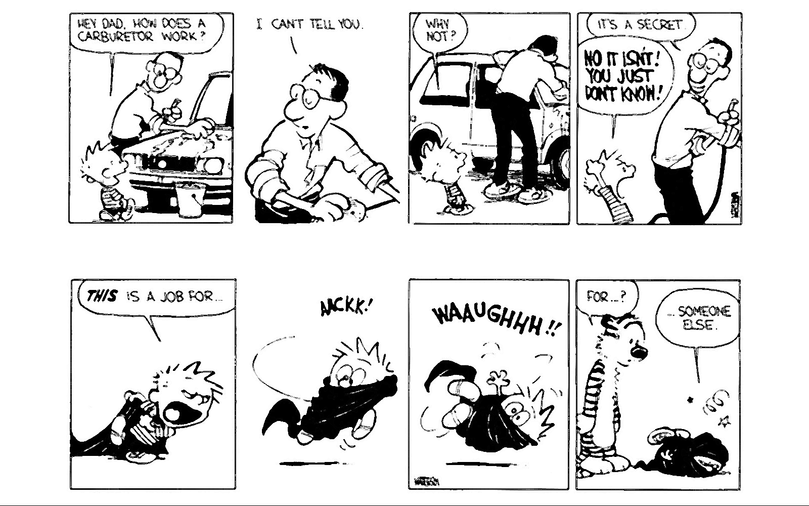
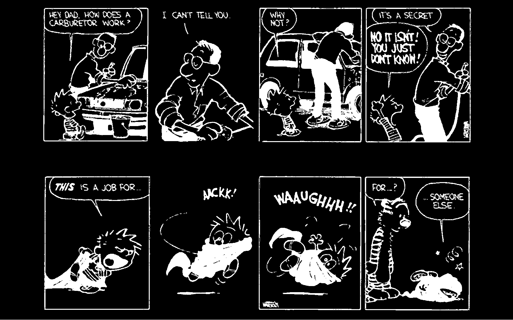
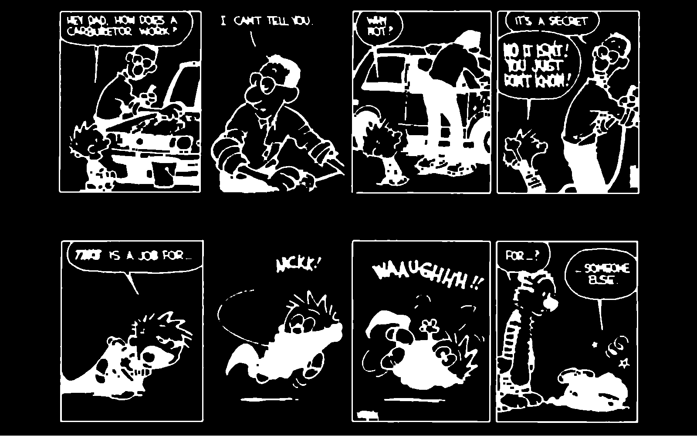
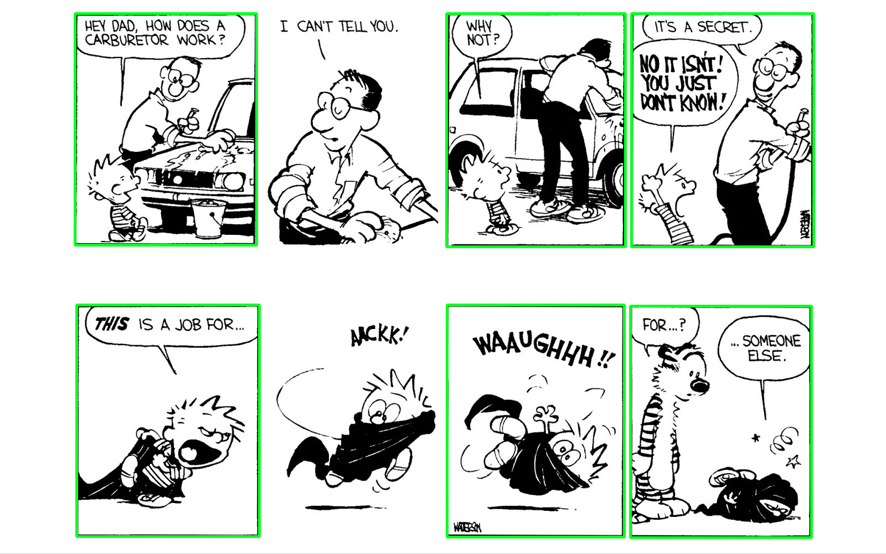

# extractpanels
Detect and extract panels from comic strips.

## Basics
Uses openCV to detect squares in images.

To enhance detection, the following modifications are made:

Sharpen image with `cv2.filter2D()`

Threshold to get a binary image with `cv2.threshold()`

Perform morphological operations with `cv2.morphologyEx()`

Finally, find countours with `cv2.findContours()` and filter by size with `cv2.contourArea()`

## Usage
`python extract.py <path to file or directory>`

The extracted files will be placed in the `extracted` folder.
